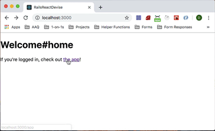
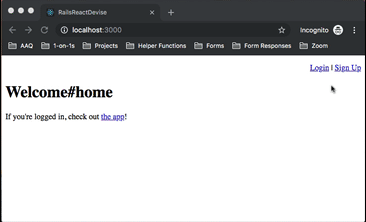
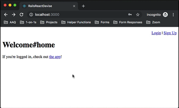
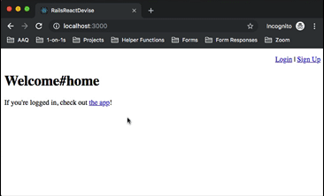

# README

This README covers how to set up a Rails/React app for User authentication using Devise

- [Set up Webpacker](#set-up-webpacker)
- [Generate the client app with create-react-app](#generate-the-client-app-with-create-react-app)
- [configure webpacker to read from create-react-app](#configure-webpacker-to-read-from-create-react-app)
- [add a home route and a route to mount the react app](#add-a-home-route-and-a-route-to-mount-the-react-app)
- [install devise and set up user logins](#install-devise-and-set-up-user-logins)
- [check for authentication before rendering the react view](#check-for-authentication-before-rendering-the-react-view)
- [create a posts resource and some seeds](#create-a-posts-resource-and-some-seeds)
- [create a namespace for our API](#create-a-namespace-for-our-api)
- [add an index action to display the current user's posts if authenticated](#add-an-index-action-to-display-the-current-user's-posts-if-authenticated)
- [add react router and a posts index that pulls the current user's posts](#add-react-router-and-a-posts-index-that-pulls-the-current-user's-posts)
- and link to a new post component
- configure new post component to pull csrf token from view and add to headers on fetch request

### My Environment

Ruby Version: 2.6.1

Rails Version: 5.2.3

Node Version: 12.1.0

OS: Mac OS 10.12.6

Text Editor: Visual Studio Code

### Tips before we start

When you finish one of each step, it's a good idea to make a commit, that way you can see in your version control which files are being added/modified in each step. (In VS Code, I see this in the source control view within the left hand menu bar.)

## Set up Webpacker

We'll want to add webpacker to the gemfile

```
gem 'webpacker'
```
and run `bundle install`. Then we'll do 
```
rails webpacker:install
```
Finally, we'll want some of the configuration we get from installing webpacker for react, so let's do
```
rails webpacker:install:react
```
We'll keep all of the changes except for the hello_react component.


## Generate the client app with create-react-app

Now we'll want to generate the client app

```
create-react-app client
```
After this, make sure to add this to your .gitignore file at the root so the repo doesn't have all your node_modules in client:
```
# .gitignore
/client/node_modules
```
We'll also want to remove all references to serviceworker in index.js so it looks like this:
```
import React from 'react';
import ReactDOM from 'react-dom';
import './index.css';
import App from './App';


ReactDOM.render(<App />, document.getElementById('root'));


```

## Configure Webpacker to Read From create-react-app

To get webpacker working with create-react-app, you'll want to change the first couple of lines of the default configuration in `config/webpacker.yml` from:
```
default: &default
  source_path: app/javascript
  source_entry_path: packs
```

to:
```
default: &default
  source_path: client
  source_entry_path: src
```

## Add a Home Route and a Route to Mount The React App

We'll generate a welcome controller with a couple of actions to handle a home page and also our react app.

```
rails g controller welcome home app --no-assets --no-helper
```

We'll set up the routes like this:
```
Rails.application.routes.draw do
  get 'welcome/home'
  get '/app', to: 'welcome#app', as: 'app'
  # For details on the DSL available within this file, see http://guides.rubyonrails.org/routing.html
  root 'welcome#home'
end
```
Then we'll add a link from the home view to the app view.
```
# app/views/welcome/home.html.erb
<h1>Welcome#home</h1>
<p>If you're logged in, check out <%= link_to "the app", app_path %>!</p>
```
Finally, we'll add the code we need to mount the react app in the app view:
```
# app/views/welcome/app.html.erb
<div id="root"></div>
<%= javascript_pack_tag 'index' %>
```
Now, let's check it out in the browser, if you click the link you should see create-react-app's landing page. **Note**: We'll get much better performance here if we're running the webpack dev server, which you can do by running 
```
./bin/webpack-dev-server
```
in a spare terminal. This is what you should see at that point:



## Install Devise and Set Up User Logins

First, let's add devise to the gemfile

```
gem 'devise'
```

and the run `bundle install`

Next we'll run the devise installer:
```
rails g devise:install
```
Then, following along with the 4 printed instructions we get after it runs, we'll add default_url_options for action mailer to the development environment file.

```
# config/environments/development.rb
config.action_mailer.default_url_options = { host: 'localhost', port: 3000 }
```

I usually puts this at around line 38 (right below the rest of the action_mailer config at the time of this writing).

Next, let's add some flash messages above the yield tag in our application layout:

```
# app/views/layouts/application.html.erb
  <p class="notice"><%= notice %></p>
  <p class="alert"><%= alert %></p>
```

Note, I skipped steps 2 and 4 because in our case we've already got a root route, and we're not going to do any customization of the default devise views. If you want to customize the login and signup forms, feel free to run 

```
rails g devise:views
```

At this point, we'll want to actually create our users:

```
rails g devise User
```

[Devise](https://github.com/plataformatec/devise) has a bunch of features we can turn on and off, for now I'm going to stick with the defaults. To add our table we'll run 

```
rails db:migrate
```

Before we hop back into the browser, let's add some simple navigation to our home view so we log in and signup/logout of our little app. (Note, we're adding this in the home view and not the layout because our react app will have its own navigation)

```
# app/views/welcome/home.html.erb
<nav style="text-align: right">
<% if user_signed_in? %>
    <%= link_to('Logout', destroy_user_session_path, method: :delete) %>          
  <% else %>
    <%= link_to('Login', new_user_session_path)  %> |
    <%= link_to('Sign Up', new_user_registration_path)  %>  
  <% end %>
</nav>
<h1>Welcome#home</h1>
<p>If you're logged in, check out <%= link_to "the app", app_path %>!</p>
```

Now we can head back to the browser and try creating a new account. 

**NOTE**: you'll need to restart your rails server if you had it running while setting up devise



Now that we have users, we can work on restricting the app to only logged in users.

## Check for Authentication Before Rendering the React View

Now that we've got authentication up and running, let's protect our app so only logged in users can view it. The quickest way to do this is to add a redirect to the controller action that will render our react app unless a user is signed in.

```
class WelcomeController < ApplicationController
  before_action :authenticate_user!, only: [:app]
  def home
  end

  def app
    
  end
end
```

Now if we try to click on the link to the app page in the browser, we get redirected to the login screen. After logging in, it sends us to the app.



## Create a Posts Resource and Some Seeds

Next, let's create a posts resource so we can set up a couple of AJAX requests from our react front end to our rails API. 

```
rails g resource post title content:text user:references --no-assets --no-helper
```

then we can run 
```
rails db:migrate
``` 
to update our database with the posts table.

We'll also want to make sure that we update the user model so it has many posts:

```
# app/models/user.rb
class User < ApplicationRecord
  # Include default devise modules. Others available are:
  # :confirmable, :lockable, :timeoutable, :trackable and :omniauthable
  devise :database_authenticatable, :registerable,
         :recoverable, :rememberable, :validatable
  has_many :posts
end

```

Finally, let's add some seeds so we've got some posts to work with.

```
# db/seeds.rb
user = User.first || User.create(email: 'test@test.com', password: 'password', password_confirmation: 'password')
posts = [
  {
    title: 'My first post', 
    content: 'The start of something special'
  },
  {
    title: 'My second post', 
    content: 'This is really getting good'
  },
  {
    title: 'Oh my god, Yeah!!!',
    content: 'Enough said.'
  }
]
posts.each do |post_hash|
  user.posts.create(post_hash)
end
```

Then we can run those with `rails db:seed`

## Create a namespace for our API

One thing we probably want to do at this point as well is to create a namespace for our api and make sure that the PostsController falls within it. This is a little extra work now and has the potential to save us large headaches down the road. For more info about why this is a good idea to do now, check out this [article on API versioning](https://paweljw.github.io/2017/07/rails-5.1-api-app-part-3-api-versioning/).  

Practically, a few things will need to change, first the routes will be namespaced, next the controller directory structure will change, and finally the way we define the controller class will be slightly different as well.

First, let's look at the routes:
```
  # config/routes.rb 
  # ..
  namespace :api do 
    namespace :v1 do 
      resources :posts
    end 
  end
```

Now the directory structure for the controllers:

```
app/controllers
├── api
│   └── v1
│       └── posts_controller.rb
├── concerns
├── application_controller.rb
└── welcome_controller.rb
```
And then update the controller to be defined under the namespaced modules.

```
module Api 
  module V1
    class PostsController < ApplicationController
    end
  end 
end

```

Now if we run `rails routes` we can see what that does for us

```
          Prefix  Verb   URI Pattern                      Controller#Action
    api_v1_posts  GET    /api/v1/posts(.:format)          api/v1/posts#index
                  POST   /api/v1/posts(.:format)          api/v1/posts#create
 new_api_v1_post  GET    /api/v1/posts/new(.:format)      api/v1/posts#new
edit_api_v1_post  GET    /api/v1/posts/:id/edit(.:format) api/v1/posts#edit
     api_v1_post  GET    /api/v1/posts/:id(.:format)      api/v1/posts#show
                  PATCH  /api/v1/posts/:id(.:format)      api/v1/posts#update
                  PUT    /api/v1/posts/:id(.:format)      api/v1/posts#update
                  DELETE /api/v1/posts/:id(.:format)      api/v1/posts#destroy
```

## Add an Index Action to Display the Current User's Posts if Authenticated

Now, let's create an index PostsController that returns the current user's posts if we're authenticated and renders an empty response with a 401 status code if not.

```
# app/controllers/api/v1/posts_controller.rb
module Api 
  module V1
    class PostsController < ApplicationController
      def index 
        if user_signed_in?
          render json: current_user.posts
        else
          render json: {}, status: 401
        end 
      end
    end
  end 
end
```

After we've got this endpoint stubbed out, we'll be able to use it from our react front-end.

## Add React Router and a Posts Index that Pulls the Current User's Posts

To start, we'll want to cd into the client directory and add in the dependencies we'll need here. (We're not using redux here yet, but we will eventually so might as well pull it in now).

```
cd client
yarn add react-router-dom react-redux redux
```

After that we'll want to create the `PostList` component `client/src/components/PostList.jsx`. This component will make a fetch request within `componentDidMount` and update the state of the component when the promise is fulfilled. 

```
componentDidMount() {
  fetch('/api/v1/posts')
    .then(posts => posts.json())
    .then(posts => {
      this.setState({
        posts: posts
      })
    })
}
```

Next, we'll use a renderPosts method to return the html for the posts that we'll render to the DOM.

```
renderPosts = () => {
  return this.state.posts.map(post => {
    return (
      <div key={post.id}>
        {post.title} - {post.content}
      </div>
    )
  })
}
```

Finally, we'll render the list as well as a link to the new posts route which we'll build out in a minute. When we're done it should look something like this:

```
// client/src/components/PostList.jsx
import React, { Component }               from 'react'
import { Link }                           from 'react-router-dom'

class PostList extends Component {

  state = {
    posts: []
  }

  componentDidMount() {
    fetch('/api/v1/posts')
      .then(posts => posts.json())
      .then(posts => {
        this.setState({
          posts: posts
        })
      })
  }

  renderPosts = () => {
    return this.state.posts.map(post => {
      return (
        <div key={post.id}>
          {post.title} - {post.content}
        </div>
      )
    })
  }

  render() {
    return (
      <div>
        PostList Component
        {this.renderPosts()}
        <Link to="/posts/new">Add a New Post</Link>
      </div>
    )
  }
}

export default PostList
```

In order to test this out, we'll need to add react router to the `client/src/App.js` and configure the root route to point to our `PostList` component. In this case we'll also want to use the `HashRouter` instead of the `BrowserRouter` so that we'll be able to easily integrate our rails routes with our client side routing in a way that still allows for page refreshes and inbound links to work properly.

```
// client/src/App.js
import React from 'react';
import {
  HashRouter as Router, 
  Route
} from 'react-router-dom';
import PostList from './components/PostList';
import './App.css';

function App() {
  return (
    <Router>
      <div className="App">
        <Route exact path="/" component={PostList} />
      </div>
    </Router>
  );
}

export default App;
```

Now that we've got these changes into our react code, let's make sure that we've still got `./bin/webpack-dev-server` running and check out our app in the browser!



Notice that the url when the app is loaded is now `localhost/3000/app#/`. All of the react routes are mounted after the `#` so we'll be able refresh the page at any of our react routes and the rails router will render our SPA with the react router picking up the client side routing after the `#`.